## Testing Documents
---
**Table of Contents**
                                      
                                                                                                   
**1. Use Case Testing**
                                    
**2. Usability Testing**

**3. Unit Testing**

**4. Instrumented Testing**

**5. Heuristic Testing**

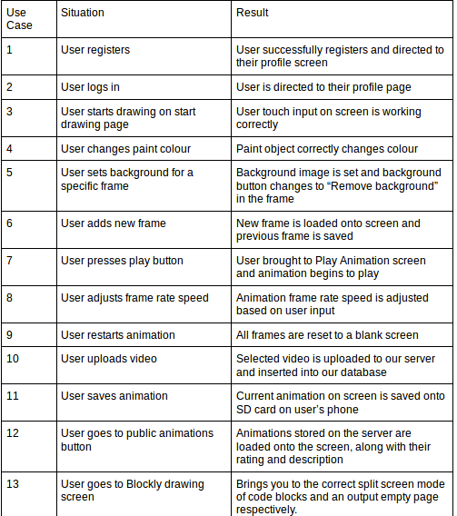

**1. Use Case Testing**

**2. Usability Testing**

*Questionnaire*

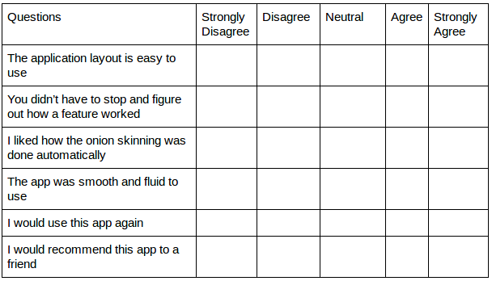

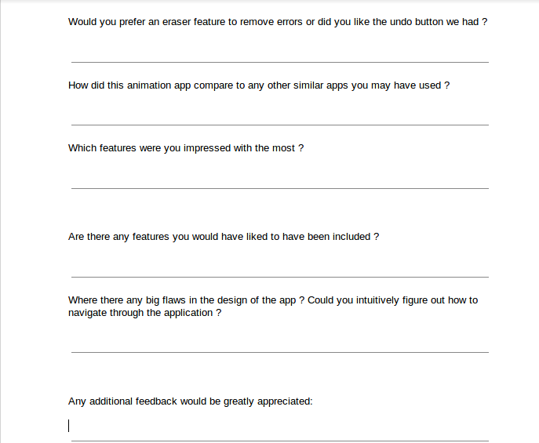

Questionnaire Responses

*Question 1*

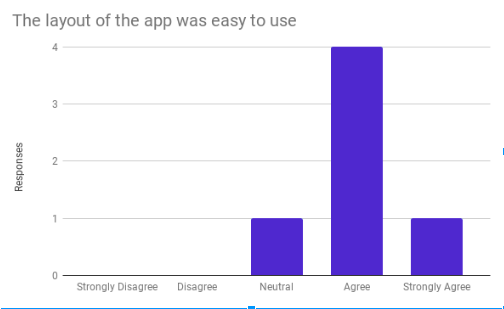

 - The majority of users found the app easy to use and were able to intuitively use the features and buttons.

*Question 2*

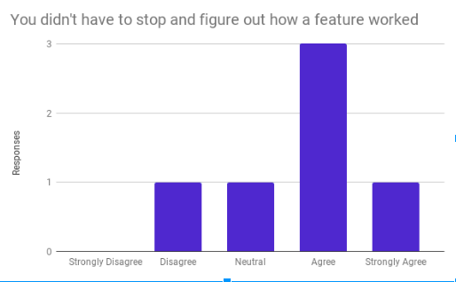

 - As you can see the majority of users were able to intuitively work out what each feature did. One user though struggled to find where the play button was located. We have subsequently moved it to a more prominent position on the screen.

*Question 3*

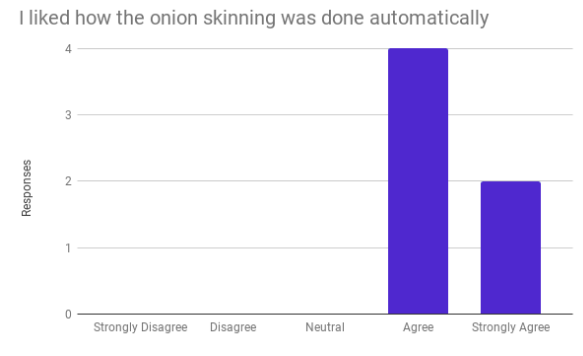

 - All users were happy with the automatic nature of the onion skinning process.

*Question 4*

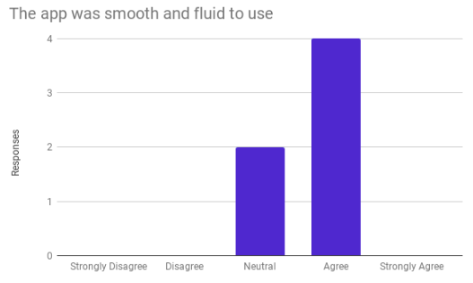

 - Most users found it comfortable with the design of the app and  where able to move fluidly between screens

*Question 5*

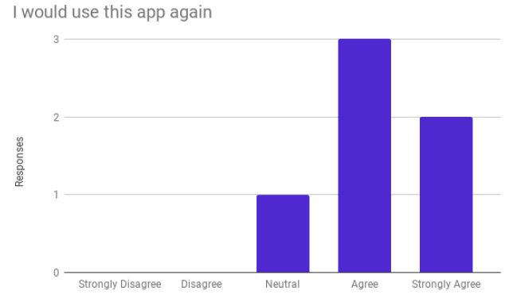

 - Almost all users would use the app again.

*Question 6*

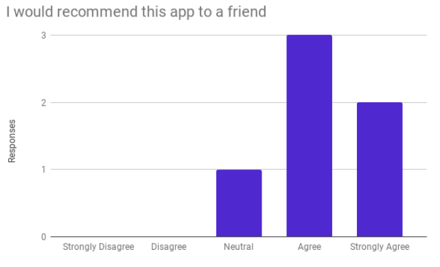

 - Almost all users would recommend this app to a friend.

*User Response Questions*

*Would you prefer an eraser feature to remove errors or did you like the undo button we had ?*

 - No, I thought the undo button worked well

 - No the undo button was ok

 - Yes, I'm used to erasing objects rather than pushing a button

 - Yes, I enjoy the aspect of rubbing stuff out on the screen

 - No, I thought the undo button was easier to use than an eraser

 - I didn’t see any difference between the two

- Include both options

*How did this animation app compare to any other similar apps you may have used ?*

 - Better laid out than other drawing apps i’ve used.

 - Less clunky than others. Onion skinning feature was very nice and helpful.

 - Other apps allow you to drag and drop objects in the drawing which your app doesn’t have, other than that I thought it was a lot easier and quicker to use than some others. Onion skinning very handy to have

 - I was very quickly able to start creating animations which I thought was better than other similar apps

 - I haven’t used any other drawing apps, but liked the whole layout of this app. Liked that it wasn't just about drawing, you could see other people's animations as well

 - I enjoyed the section where I could see and rate other people's animations. That was quite different to other drawing apps. It created a bit of a "social media feel" to the app.

*Which features were you impressed with the most ?*

 - Onion Skinning

 - Public Animations page.

 - Rating the videos

 - Onion Skinning

 - Liked being able to get my animation rated by others

 - Onion Skinning

*Are there any features you would have liked to have been included ?*

 - Drag and drop objects in the drawing

 - Being able to add in objects like people or houses into the drawings

 - Being able to move objects with my fingers

 - Can’t think of any

 - A feature that makes the paint brush turn charcoal

**3. Unit Testing**

**4. Instrumented Testing**

**5. Heuristic Testing**

We are using Schneiderman's 8 golden rules to help guide us through the design of our application.

*Strive for consistency*

We have ensured that the design and layout of our app remains consistent throughout. We have used consistent colouring throughout all screens in the app.

*Offer informative feedback*

We offer informative feedback to users when they input incorrect data in the login fields.  As you can see in the pictures below, when a user inputs an incorrect email or password input. This helps the user to see where they are going wrong and to correct it. 

                                                
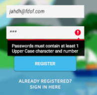

*Design dialogs to yield closure* 

When a user completes a task the app relays the result of the command to the user. This enables the user with the confidence and knowledge that their task was completed. They are no longer wondering if their actions were received or not. An example of this can be seen when a user logs in , uploads an animation.

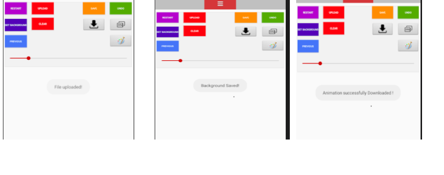

      
   

